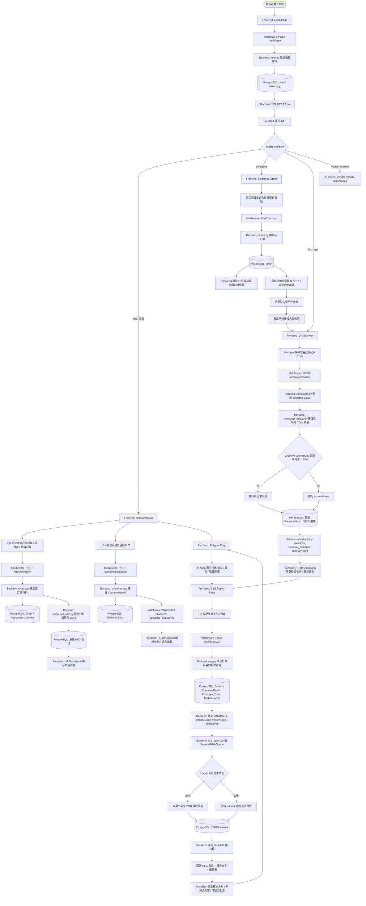

# hackathon
黑客松

```mermaid
flowchart TD
    %% 使用者入口
    Start([使用者進入系統]) --> LoginPage[Frontend: Login Page]

    LoginPage --> LoginAPI[Middleware: POST /auth/login]
    LoginAPI --> BackendAuth[Backend: auth.py 驗證帳號密碼]
    BackendAuth --> DBUser[(PostgreSQL: User / Company)]
    DBUser --> JWT[Backend 回傳 JWT Token]
    JWT --> StoreToken[Frontend 儲存 JWT]

    %% 角色分流
    StoreToken --> RoleCheck{判斷使用者角色}

    RoleCheck -->|HR / 高層| HRDashboard[Frontend: HR Dashboard]
    RoleCheck -->|Employee| EmployeeOrder[Frontend: Employee Order]
    RoleCheck -->|Manager| QRScanner[Frontend: QR Scanner]
    RoleCheck -->|Vendor / Admin| VendorPage[Frontend: Vendor Portal / Applications]

    %% HR 設定本週訂餐
    HRDashboard --> WeeklySetup[HR 設定本週合作餐廳 / 服務商 / 預估份數]
    WeeklySetup --> OrderAPI[Middleware: POST /orders/weekly]
    OrderAPI --> BackendOrders[Backend: orders.py 建立週訂餐資料]
    BackendOrders --> DBOrders[(PostgreSQL: Order / Restaurant / Vendor)]

    BackendOrders --> EstimateCalc[Backend: container_calc.py 預估包材減量與 CO₂e]
    EstimateCalc --> DBEstimate[(PostgreSQL: 預估 ESG 指標)]
    DBEstimate --> HRDashboardUpdate[Frontend: HR Dashboard 顯示預估減量]

    %% 建立容器批次
    HRDashboard --> CreateBatch[HR / 管理員建立容器批次]
    CreateBatch --> BatchAPI[Middleware: POST /containers/dispatch]
    BatchAPI --> BackendContainers[Backend: containers.py 建立 ContainerBatch]
    BackendContainers --> DBBatch[(PostgreSQL: ContainerBatch)]

    BackendContainers --> WSDispatch[Middleware WebSocket: broadcast container_dispatched]
    WSDispatch --> HRRealtime[Frontend: HR Dashboard 即時更新在途容器數]

    %% 員工點餐
    EmployeeOrder --> SelectMeal[員工選擇本週合作餐廳與餐點]
    SelectMeal --> MealOrderAPI[Middleware: POST /orders]
    MealOrderAPI --> BackendCreateOrder[Backend: orders.py 建立員工訂單]
    BackendCreateOrder --> DBEmployeeOrder[(PostgreSQL: Order)]
    DBEmployeeOrder --> OrderResult[Frontend: 顯示訂餐成功與循環包材提醒]

    %% 餐廳出餐
    DBEmployeeOrder --> RestaurantPrepare[餐廳使用循環餐盒 / 杯子 / 外送包材出餐]
    RestaurantPrepare --> PackageInUse[容器進入使用中狀態]

    %% QR 回收
    PackageInUse --> EmployeeReturn[員工用餐後投入回收站]
    EmployeeReturn --> QRScanner
    QRScanner --> ScanQR[Manager 掃描容器批次 QR Code]
    ScanQR --> CollectAPI[Middleware: POST /containers/collect]
    CollectAPI --> BackendCollect[Backend: containers.py 更新 collected_count]

    BackendCollect --> CarbonCalc[Backend: container_calc.py 計算回收率與 CO₂e 減量]
    CarbonCalc --> AnomalyCheck{Backend: anomaly.py 回收率是否 < 90%}

    AnomalyCheck -->|否| NormalResult[標記為正常回收]
    AnomalyCheck -->|是| AnomalyResult[標記 anomaly:true]

    NormalResult --> DBCollect[(PostgreSQL: 更新 ContainerBatch / ESG 數據)]
    AnomalyResult --> DBCollect

    DBCollect --> WSCollect[Middleware WebSocket: broadcast container_collected / anomaly_alert]
    WSCollect --> HRRealtime2[Frontend: HR Dashboard 即時更新回收率 / 異常警告]

    %% ESG 報告生成
    HRRealtime2 --> ESGPage[Frontend: ESG Report Page]
    ESGPage --> GenerateESG[HR 點擊生成 ESG 報表]
    GenerateESG --> ESGAPI[Middleware: POST /esg/generate]
    ESGAPI --> BackendESG[Backend: esg.py 聚合訂單與容器批次資料]

    BackendESG --> DBRead[(PostgreSQL: Orders / ContainerBatch / PackagingType / CarbonFactor)]
    DBRead --> ESGCalc[Backend: 計算 totalMeals / circularMeals / returnRate / co2eSaved]
    ESGCalc --> ESGAgent[Backend: esg_agent.py 組 Prompt 呼叫 Claude]

    ESGAgent --> Claude{Claude API 是否成功}
    Claude -->|成功| ClaudeText[取得中英文 ESG 報告段落]
    Claude -->|失敗| FallbackText[使用 fallback 模板產生報告]

    ClaudeText --> SaveESG[(PostgreSQL: ESGSummary)]
    FallbackText --> SaveESG

    SaveESG --> AuditHash[Backend: 產生 SHA-256 稽核碼]
    AuditHash --> ESGResponse[回傳 ESG 數據 + 報告文字 + 稽核碼]
    ESGResponse --> ESGFrontend[Frontend: 顯示數據卡片 / 中英文文案 / 可複製報告]

    %% AI Agent
    HRDashboard --> AIAgentPage[Frontend: AI Agent Page]
    ESGFrontend --> AIAgentPage
    AIAgentPage --> AgentInsight[AI Agent 顯示資料缺口 / 異常 / 改善建議]
    AgentInsight --> ESGPage
```